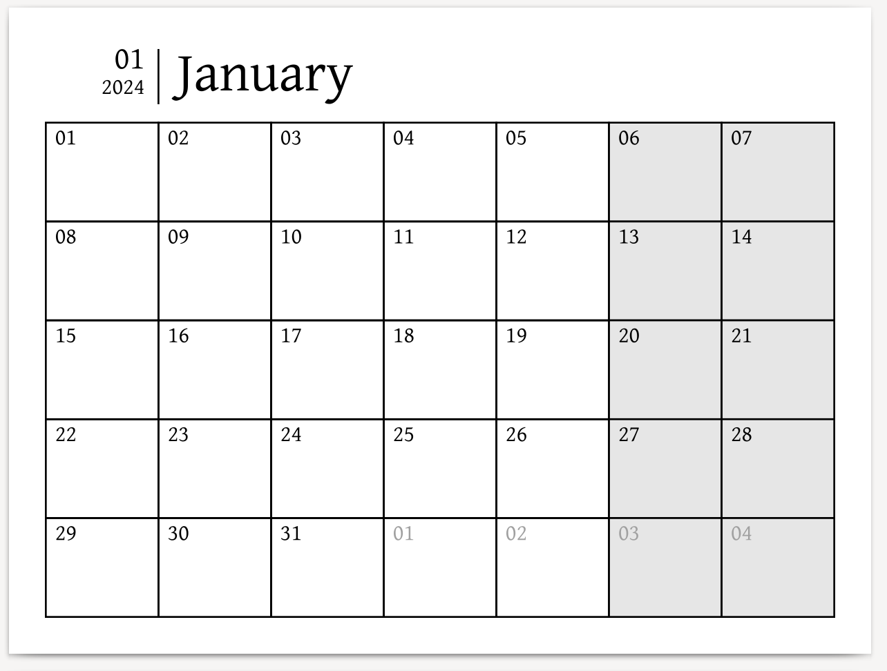
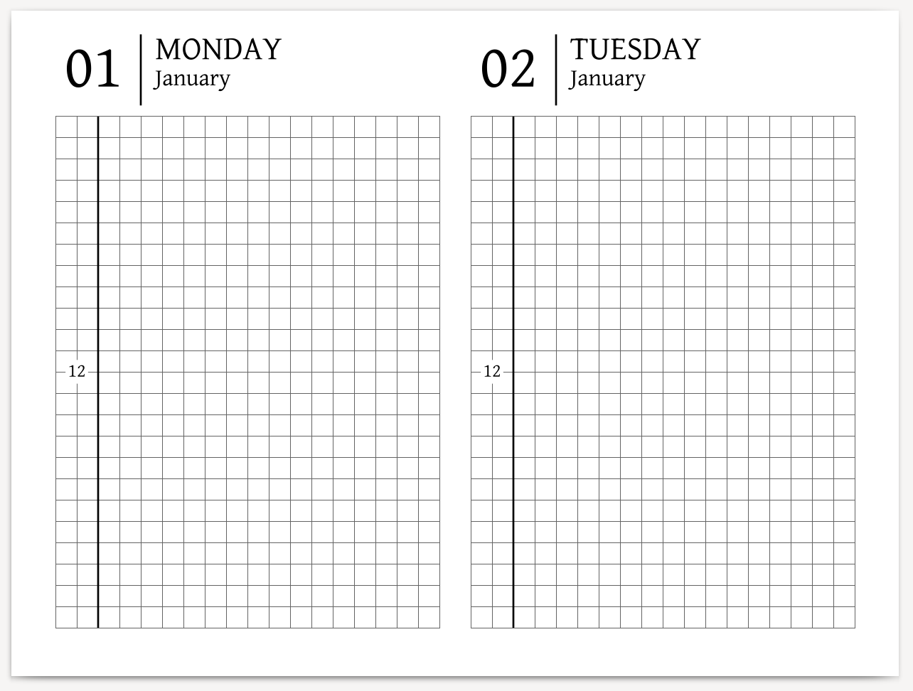

[](https://github.com/Seryiza/remplater/actions/workflows/ci.yml)

# Remplater

My PDF templates and code to generate them targeted Remarkable 2.

Feel free to [download](https://github.com/Seryiza/remplater/releases) and generate PDFs, create your templates via clojure, and suggest ideas for new templates in [issues](https://github.com/Seryiza/remplater/issues).

### Templates
#### Remarkable-Calendar
inspired by [elainajones](https://github.com/elainajones/remarkable-calendar) ⨯ Hobonichi Techo


<details>
  <summary>Template Details</summary>

  I love this cool and minimalistic template. I reimplemented it to ensure that this project has enough features.

  Options:
  - `--start-date`: start date (format `YYYY-MM-DD`)
  - `--end-date`: end date (format `YYYY-MM-DD`)
  - `--timeline-labels`: timeline labels (format `rowindex1:label1,rowindex2:label2`)

  Code Location:
  ```
src/remplater/templates/remarkable_calendar.clj
```
  
  Example CLI Command:
  ```bash
java -jar target/remplater.jar generate remarkable-calendar --start-date=2024-01-01 --end-date=2025-01-31 --filename this.pdf --timeline-labels=12:17
```
</details>

| Monthly View | Daily View |
| ------------ | ---------- |
|  |  |

## How to download PDFs

You can download already generated PDF files from [releases](https://github.com/Seryiza/remplater/releases).

Also, there's [the Development Prerelease](https://github.com/Seryiza/remplater/releases/tag/latest) with the latest code changes. You can use it too, but it's unstable.

## How to generate PDFs

Requirements: Java

You can generate PDF templates for custom date ranges and some customization. Download and run the latest jar file from [releases](https://github.com/Seryiza/remplater/releases).

For example:
```bash
java -jar remplater.jar generate remarkable-calendar --start-date=2024-01-01 --end-date=2025-01-31 --filename this.pdf --timeline-labels=12:17
```

You can get help and display all options:
```
$ java -jar remplater.jar
Remplater: Remarkable Templater.

Usage:
  remplater generate remarkable-calendar [options] --start-date=<2024-01-01> --end-date=<2025-01-31> [--timeline-labels=<0:12,10:18>]
  remplater --help
  remplater --version

Options:
  --help                  Show this screen
  --version               Show version
  --filename=<filename>   Output filename
```

## How to develop this project

Requirements: Java, Clojure

Just start REPL as usual. For the introduction in the codebase, you can read [existing templates](https://github.com/Seryiza/remplater/blob/master/src/remplater/templates/remarkable_calendar.clj).

Remplater has automated tests. You can run them inside your editor or command `make test`.

You can build a jar file via the command `make uberjar`.
